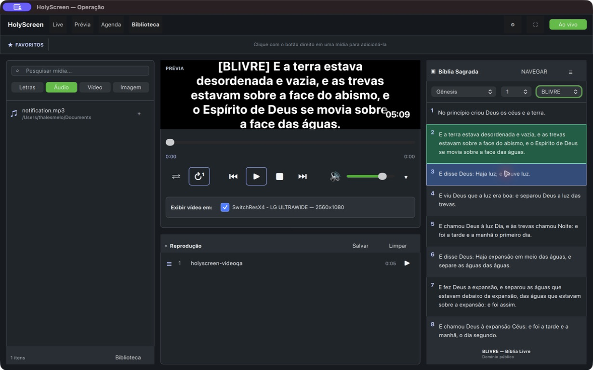

# HolyScreen

[English](README.md)

HolyScreen é um motor desktop open source de apresentação para igrejas,
construído em C++20 e Qt 6/QML para funcionar offline.

> Estado: prévia de desenvolvimento `0.10.3`. Ainda não é o release estável `1.0.0`.



## Instalar uma prévia

1. Acesse as [releases](https://github.com/sharkwedy/holyscreen/releases).
2. Baixe `.exe`/`.zip` no Windows, `.dmg` no macOS ou
   `.AppImage`/`.deb`/`.tar.gz` no Linux.
3. Confira o arquivo com o `SHA256SUMS` da release.
4. Instale ou extraia o pacote e inicie o HolyScreen.

As prévias podem não ter assinatura digital. Faça backup dos dados importantes
antes de atualizar entre versões de desenvolvimento.

## Compilar e testar

Requer CMake 3.21+, compilador C++20 e Qt 6.8+ com os módulos listados no
[README em inglês](README.md).

```bash
cmake -S . -B build -DBUILD_TESTING=ON
cmake --build build --parallel
ctest --test-dir build --output-on-failure
cmake --build build --target church-presenter_qmllint
```

Consulte [ROADMAP.md](docs/ROADMAP.md), [CONTRIBUTING.md](CONTRIBUTING.md),
[CODE_OF_CONDUCT.md](CODE_OF_CONDUCT.md), [GOVERNANCE.md](GOVERNANCE.md),
[SUPPORT.md](SUPPORT.md) e [SECURITY.md](SECURITY.md). O código é GPLv3.

A importação bíblica aceita pasta/repositório canônico, Git HTTPS público, ZIP
público e JSON legado, com atualização idempotente, metadados de origem,
progresso, cancelamento e confirmação para conteúdo não marcado como domínio
público. Consulte o [guia de importação bíblica](docs/BIBLE_IMPORT.md).
